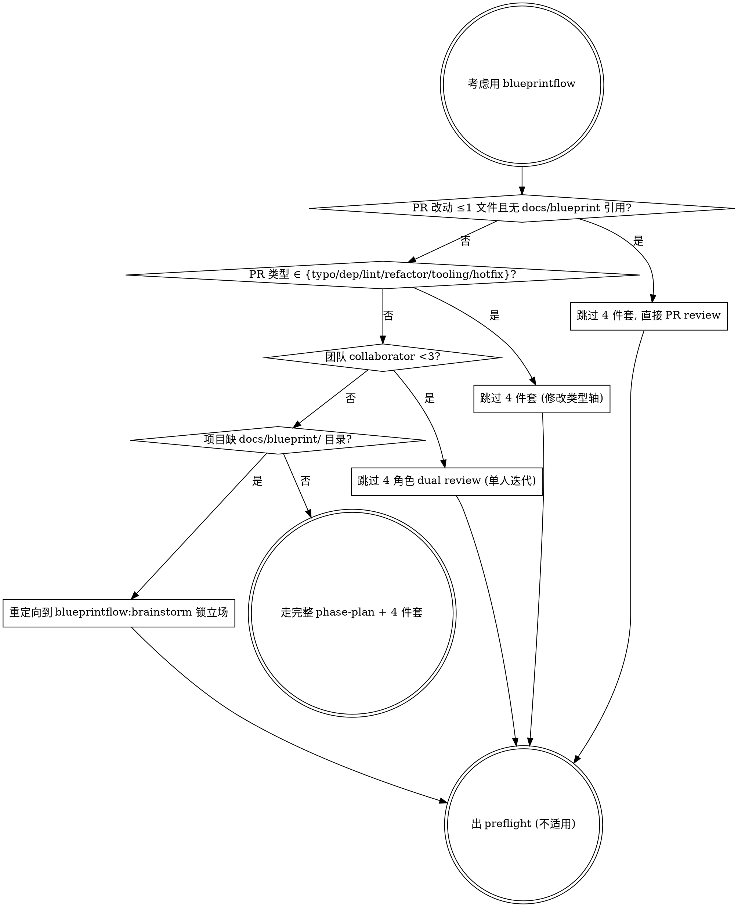

# Phase Plan

蓝图 ready 后, Architect 主, 把项目拆成 Phase 序列, 每 Phase 锚一个**价值闭环** (端到端用户能用), 不是按层拆。

## Preflight check

开始用这套重型基建之前, 先跑决策图判定是否合适. 6 不适用场景按两轴拆: **任务大小轴** (改动量 / 团队 / 概念锁定) + **修改类型轴** (typo / dep / lint / single-file refactor / tooling / hotfix), 互补不冲突, 4 决策点 diamond 串行:



### 4 决策点详解

1. **单 PR 改动 ≤1 文件 + 无 `docs/blueprint/` 引用** (任务大小轴) → 跳过 4 件套, 直接 PR review
   - 检查: `git diff --name-only main | wc -l` ≤ 1 且 `git diff main | grep -c 'docs/blueprint'` == 0
   - 理由: 4 件套 (spec / stance / acceptance / content-lock) 是 milestone 级开销, 单文件 fix / 注释改动用不上; 走 `blueprintflow:pr-review-flow` 单 review 路径足够
   - 反约束: 单文件改动如果引蓝图 §X.Y (修立场 / 改概念定义) → 不能跳过, 必须走 4 件套 + 4 角色 review

2. **PR 类型 ∈ {typo / dep bump / lint patch / single-file refactor / CI tooling / hotfix}** (修改类型轴) → 跳过 4 件套
   - 检查 (任一命中即跳): typo (commit msg 含 `typo` / `fix typo`); dep bump (仅 `package.json` / `go.mod` / `Cargo.toml` + lockfile); lint patch (仅 `.eslintrc` / `.golangci.yml` / formatter 配置); single-file refactor (变量改名 / 抽函数, 不改 API / 立场); CI tooling (`.github/` / ruleset / cron 调整); hotfix (`hotfix/` 分支前缀 + production incident 关联)
   - 理由: 这些类型 PR 形状机械化 (依赖管理 / 工具链 / 紧急修复), 走 spec → stance → acceptance → content-lock 4 件套是空转; hotfix 还要 skip brainstorm (紧急路径不能等立场锁)
   - 反约束: ❌ dep bump 如果 major version (breaking) → 退回 4 件套 (跨版本 = 改概念契约); ❌ single-file refactor 如果跨蓝图 §X.Y 锚点 → 退回; ❌ hotfix 修完 7 天内必须补 retro PR 写明根因 (不能用 hotfix 永久绕过)

3. **团队 collaborator < 3** (任务大小轴) → 跳过 4 角色 dual review (单人迭代场景)
   - 检查: 仓库实际 active contributor 数 (`gh api repos/:owner/:repo/contributors | jq length`) < 3
   - 理由: 4 件套 + 双 review 路径假设 PM / Dev / QA / Architect 多人协作; 单人 / 双人项目走不起 4 角色, 自审即可
   - 反约束: AI agent 团队 (Borgee 模式: 1 human + 6 X马 agent) **不算单人** — agent 履行多角色协作, 走完整流程

4. **项目缺 `docs/blueprint/` 目录** (任务大小轴) → 重定向到 `blueprintflow:brainstorm` 锁立场再回来
   - 检查: `test -d docs/blueprint/ && ls docs/blueprint/*.md | wc -l` ≥ 1
   - 理由: phase-plan 假设 \"蓝图 ready\" (本 skill 第一句话字面), 没立场 / 没概念模型直接拆 Phase = 拆出空壳; 退一步走 brainstorm + blueprint-write 锁住立场再回来
   - 反约束: `docs/blueprint/` 存在但只有 README 没具体模块文档 → 仍算未 ready, 走 brainstorm 补 (单 README 不构成产品形状 source of truth)

### 反模式

- ❌ 不跑 preflight 直接 phase-plan: 重型基建套到不需要的项目上, 拖慢 short-task 迭代
- ❌ preflight 判 \"不适用\" 后又勉强跑一遍: 决策图给出 \"不适用\" 即 exit, 不要回头硬上
- ❌ 4 条决策点用 \"或\" 短路: 必须按图顺序走 (改动量 → 修改类型 → 团队规模 → 蓝图 ready), 后置条件依赖前置确认
- ❌ 借 hotfix / dep bump 类型轴永久绕 4 件套: 修完 7 天内必须补 retro PR (跟决策点 2 反约束一致)


## Phase 拆分原则

按**价值闭环**拆, 不按技术层:

- ❌ 错: Phase 1 schema / Phase 2 server / Phase 3 client (技术层, 没价值)
- ✅ 对: Phase 1 身份闭环 / Phase 2 协作闭环 / Phase 3 第二维度产品 / Phase 4+ 剩余 (每 Phase 独立可演示)

**Borgee 实例**:
- Phase 0 基建 (INFRA-1)
- Phase 1 身份闭环 (CM-1 + AP-0 + CM-3) — 一人一 org, 注册即用
- Phase 2 协作闭环 ⭐ (CM-4 邀请 + 通知) — 多人多 agent 协作
- Phase 3 第二维度产品 (CHN + CV) — channel + canvas
- Phase 4+ 剩余模块

## 退出 gate 设计

每 Phase 必须有**机器化** + **用户感知**双轨退出条件:

### 严格闸 (机器化)
- e.g. G2.0 cookie 串扰反向断言 / G2.3 节流单测 / G2.6 lint 通过

### 用户感知闸 (signoff)
- 标志性 milestone 跑 demo + 野马签字 + 关键截屏
- 跨 Phase 不能省 (Phase 2 退出 = 真人能用 + 野马拍 ✅)

### 留账闸 (允许 partial signoff)
- 不阻塞 Phase 退出, 但必须挂 Phase N+1 PR # 编号锁 (规则 6)
- e.g. G2.5 留 Phase 4 AL-3 + G2.6 留 Phase 4 BPP-1 lint

实例: Phase 2 退出 announcement (#268) 5 SIGNED + 3 PARTIAL + 2 DEFERRED, 全挂 Phase 4 PR # 编号锁。

## 4 道防偏离闸门

每 milestone 实施前必须挂 4 道闸:

1. **闸 1 模板自检** (Architect): spec brief 用模板写, 验通用性
2. **闸 2 grep §X.Y 锚点** (Architect): 每 milestone 有蓝图锚点
3. **闸 3 反查表** (PM + Architect): 每模块文档末尾, 立场一句话写不出 = 漂移
4. **闸 4 标志性 milestone 签字 + 关键截屏** (PM, AI 团队不录视频)

闸 1+2 在 spec brief PR 走 (`blueprintflow:milestone-fourpiece`), 闸 3 在 stance + acceptance 走, 闸 4 在 demo signoff 走 (`blueprintflow:phase-exit-gate` 收尾)。

## 落地清单

**Path**: `docs/implementation/`

- **PROGRESS.md** — 单一进度真相, 每 PR / Phase gate 状态变化更新
- **00-foundation/execution-plan.md** — 5 Phase + 退出 gate + 4 道闸门
- **00-foundation/roadmap.md** — 缩略图 + 首波 demo 路径
- **00-foundation/how-to-write-milestone.md** — milestone 模板 + acceptance 四选一
- **modules/** — 11 模块大纲, 每 milestone 拆到 PR 级 (≤ 3 天 / ≤ 500 行)

## PROGRESS.md 模板

```
| Phase | 状态 | 退出条件 | 备注 |
|-------|------|---------|------|
| Phase 0 基建闭环 | ✅ DONE | G0.x 全过 | 起步 |
| Phase 1 身份闭环 | ✅ DONE | G1.x 全过 | CM-1+AP-0+CM-3 |
| Phase 2 协作闭环 ⭐ | 🔄/✅ | 严格 N + 留账挂 Phase 4 PR # | CM-4 ⭐ |
| Phase 3 第二维度 | TODO | G3.x + 野马签字 | 等 Phase 2 |
| Phase 4+ 剩余 | TODO | G4.audit | 等 Phase 3 |
```

每 PR merged 立即更新对应 milestone 行 ⚪→✅ (走 follow-up 翻牌 PR, 跟 `blueprintflow:pr-review-flow`)。

## 反模式

- ❌ 按技术层拆 Phase (没价值闭环)
- ❌ 退出 gate 只靠机器化 (漏用户感知)
- ❌ 留账闸不挂 Phase N+1 PR # (规则 6 强制)
- ❌ PROGRESS.md 不及时更新 (slow-cron audit 抓出会派活补)

## 调用方式

蓝图 ready 后:
```
follow skill blueprintflow-phase-plan
落 PROGRESS.md + execution-plan + roadmap
```
